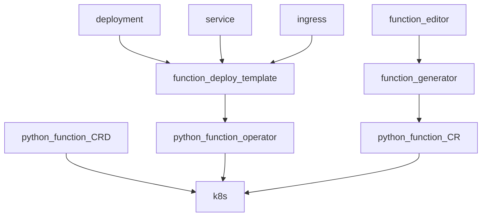
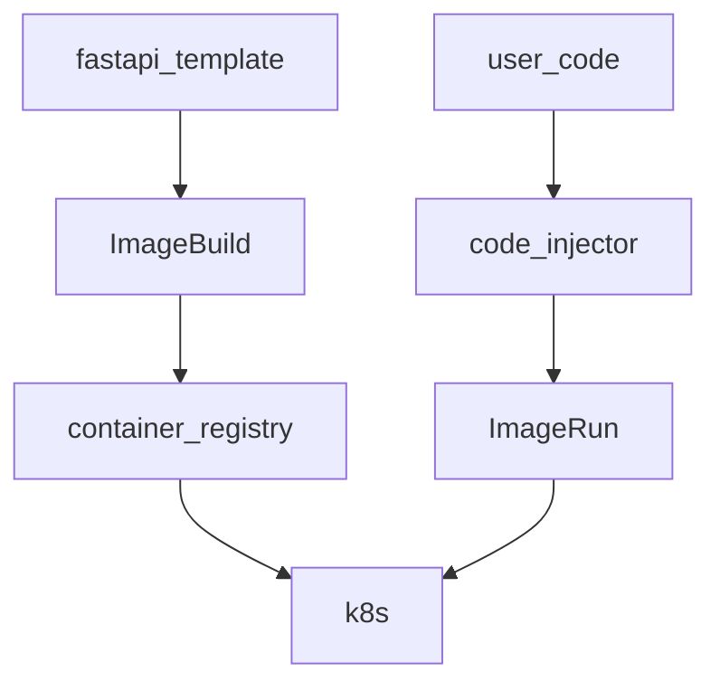

# easy-faas
Build Functions easily using kubernetes operator pattern

## Entire Architecture

```mermaid
graph TD;
    python_function_CRD-->k8s;
    python_function_operator-->k8s;
    function_generator-->python_function_CR;
    python_function_CR-->k8s;
    function_deploy_template-->python_function_operator;
    deployment-->function_deploy_template;
    service-->function_deploy_template;
    ingress-->function_deploy_template;
    function_editor-->function_generator;
```
- Function Editor
- Funtion Generator

```mermaid
graph TD;
    fastapi_template-->ImageBuild;
    code_injector-->ImageRun;
    user_code-->code_injector;
    ImageBuild-->container_registry;
    container_registry-->k8s;
    ImageRun-->k8s;
```
